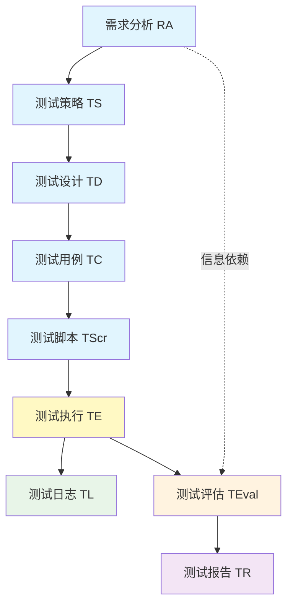
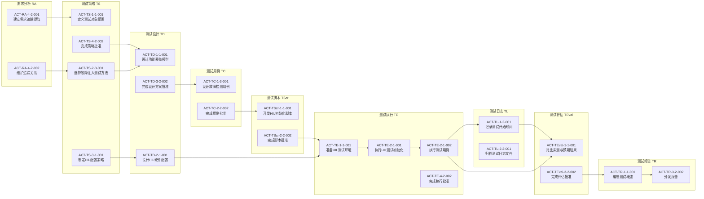

---
AIGC:
    ContentProducer: Minimax Agent AI
    ContentPropagator: Minimax Agent AI
    Label: AIGC
    ProduceID: "00000000000000000000000000000000"
    PropagateID: "00000000000000000000000000000000"
    ReservedCode1: 304402207a0c60710918ad31d730a3bf65e9b510ea2a22d0595e58339d9547de04d6143902207a1d3a48a00c3843270faa04974845740e1d429851cba15ce04c053f5ea904d4
    ReservedCode2: 3045022000b9f0da6f1f7fce8aa46f9371da76b527550716778783a285abb6070936041c022100a2cd99796f61c13994bb5c713eb213174bcea3afef2b6cab63147aafb333e96b
---

# 车载运动域/底盘域控制器测试活动依赖关系矩阵

## 文档信息

| 属性 | 内容 |
|------|------|
| 版本号 | V1.0.0 |
| 作者 | MiniMax Agent |
| 创建日期 | 2026-04-07 |
| 文档状态 | 正式发布 |

## 1. 依赖关系概述

测试活动体系中的依赖关系分为三类：顺序依赖、资源依赖和信息依赖。顺序依赖是指某些活动必须在前置活动完成后才能开始；资源依赖是指多个活动共享有限的资源，需要协调安排；信息依赖是指某个活动的输出作为另一个活动的输入。本文档重点描述顺序依赖和信息依赖关系，确保测试活动的合理排序和正确执行。

对于车载运动域/底盘域控制器测试活动，依赖关系的管理尤为重要。由于底盘域控制器涉及车辆安全功能，测试活动的完整性和正确性直接影响产品质量。清晰的依赖关系定义可以避免测试活动的返工，提高测试效率，确保测试结果的可靠性。

## 2. 主活动间依赖关系

### 2.1 主活动依赖矩阵

| 源活动 → 目标活动 | 依赖类型 | 依赖说明 |
|-------------------|----------|----------|
| 需求分析 → 测试策略 | 顺序依赖 | 测试策略必须基于需求分析的输出制定 |
| 测试策略 → 测试设计 | 顺序依赖 | 测试设计必须遵循测试策略定义的方法 |
| 测试设计 → 测试用例 | 顺序依赖 | 测试用例必须基于测试设计方案编制 |
| 测试用例 → 测试脚本 | 顺序依赖 | 测试脚本必须实现测试用例定义的测试逻辑 |
| 测试脚本 → 测试执行 | 顺序依赖 | 测试执行必须使用已通过评审的测试脚本 |
| 测试执行 → 测试日志 | 信息依赖 | 测试日志记录测试执行的详细过程 |
| 测试执行 → 测试评估 | 顺序依赖 | 测试评估基于测试执行的结果进行 |
| 测试评估 → 测试报告 | 顺序依赖 | 测试报告汇总测试评估的结论 |
| 需求分析 → 测试评估 | 信息依赖 | 测试评估需要参考需求分析的输出验证覆盖率 |

### 2.2 主活动依赖关系图（Mermaid）



## 3. 叶子节点依赖关系

### 3.1 需求分析活动内部依赖

| 叶子节点编码 | 叶子节点名称 | 前序依赖节点 | 依赖类型 |
|--------------|--------------|--------------|----------|
| ACT-RA-1-1-001 | 识别法规标准需求 | 无 | 无 |
| ACT-RA-1-1-002 | 识别客户需求 | ACT-RA-1-1-001 | 顺序依赖 |
| ACT-RA-1-1-003 | 识别内部设计需求 | ACT-RA-1-1-001 | 顺序依赖 |
| ACT-RA-1-2-001 | 收集SRS文档 | ACT-RA-1-1-002, ACT-RA-1-1-003 | 信息依赖 |
| ACT-RA-1-2-002 | 收集系统架构文档 | ACT-RA-1-2-001 | 顺序依赖 |
| ACT-RA-1-2-003 | 收集接口规范文档 | ACT-RA-1-2-001 | 顺序依赖 |
| ACT-RA-1-2-004 | 收集功能安全文档 | ACT-RA-1-2-001 | 顺序依赖 |
| ACT-RA-1-3-001 | 组织需求澄清会议 | ACT-RA-1-2-002, ACT-RA-1-2-003, ACT-RA-1-2-004 | 顺序依赖 |
| ACT-RA-1-3-002 | 输出会议纪要 | ACT-RA-1-3-001 | 顺序依赖 |
| ACT-RA-2-1-001 | 分析控制功能需求 | ACT-RA-1-3-002 | 顺序依赖 |
| ACT-RA-2-1-002 | 分析通信功能需求 | ACT-RA-1-3-002 | 顺序依赖 |
| ACT-RA-2-1-003 | 分析诊断功能需求 | ACT-RA-1-3-002 | 顺序依赖 |
| ACT-RA-2-2-001 | 分析响应时间需求 | ACT-RA-2-1-001 | 顺序依赖 |
| ACT-RA-2-2-002 | 分析精度需求 | ACT-RA-2-1-001 | 顺序依赖 |
| ACT-RA-2-2-003 | 分析负载能力需求 | ACT-RA-2-1-001 | 顺序依赖 |
| ACT-RA-2-3-001 | 识别ASIL等级 | ACT-RA-1-2-004 | 顺序依赖 |
| ACT-RA-2-3-002 | 分析安全机制需求 | ACT-RA-2-3-001 | 顺序依赖 |
| ACT-RA-2-3-003 | 分析故障处理需求 | ACT-RA-2-3-001 | 顺序依赖 |
| ACT-RA-2-4-001 | 分析CAN接口需求 | ACT-RA-1-2-003 | 顺序依赖 |
| ACT-RA-2-4-002 | 分析LIN接口需求 | ACT-RA-1-2-003 | 顺序依赖 |
| ACT-RA-2-4-003 | 分析Ethernet接口需求 | ACT-RA-1-2-003 | 顺序依赖 |
| ACT-RA-3-1-001 | 建立功能分解结构 | ACT-RA-2-1-001, ACT-RA-2-1-002, ACT-RA-2-1-003 | 顺序依赖 |
| ACT-RA-3-1-002 | 建立数据流图 | ACT-RA-3-1-001 | 顺序依赖 |
| ACT-RA-3-1-003 | 建立状态机模型 | ACT-RA-3-1-001 | 顺序依赖 |
| ACT-RA-3-2-001 | 建立驾驶场景库 | ACT-RA-3-1-002 | 顺序依赖 |
| ACT-RA-3-2-002 | 建立故障场景库 | ACT-RA-2-3-002, ACT-RA-2-3-003 | 顺序依赖 |
| ACT-RA-3-2-003 | 建立环境条件库 | ACT-RA-3-1-002 | 顺序依赖 |
| ACT-RA-3-3-001 | 组织模型评审 | ACT-RA-3-1-002, ACT-RA-3-1-003, ACT-RA-3-2-001, ACT-RA-3-2-002, ACT-RA-3-2-003 | 顺序依赖 |
| ACT-RA-3-3-002 | 修订模型问题 | ACT-RA-3-3-001 | 顺序依赖 |
| ACT-RA-4-1-001 | 准备评审材料 | ACT-RA-2-1-001, ACT-RA-2-1-002, ACT-RA-2-1-003, ACT-RA-2-2-001, ACT-RA-2-2-002, ACT-RA-2-2-003, ACT-RA-2-3-001, ACT-RA-2-3-002, ACT-RA-2-3-003, ACT-RA-2-4-001, ACT-RA-2-4-002, ACT-RA-2-4-003 | 信息依赖 |
| ACT-RA-4-1-002 | 执行需求评审 | ACT-RA-4-1-001 | 顺序依赖 |
| ACT-RA-4-1-003 | 跟踪评审问题 | ACT-RA-4-1-002 | 顺序依赖 |
| ACT-RA-4-2-001 | 建立需求追踪矩阵 | ACT-RA-4-1-002, ACT-RA-3-3-001 | 顺序依赖 |
| ACT-RA-4-2-002 | 维护追踪关系 | ACT-RA-4-2-001 | 顺序依赖 |

### 3.2 测试策略活动内部依赖

| 叶子节点编码 | 叶子节点名称 | 前序依赖节点 | 依赖类型 |
|--------------|--------------|--------------|----------|
| ACT-TS-1-1-001 | 定义测试对象范围 | ACT-RA-4-2-001 | 顺序依赖 |
| ACT-TS-1-1-002 | 定义测试类型范围 | ACT-TS-1-1-001 | 顺序依赖 |
| ACT-TS-1-1-003 | 定义测试环境范围 | ACT-TS-1-1-001 | 顺序依赖 |
| ACT-TS-1-2-001 | 规划单元测试级别 | ACT-TS-1-1-002 | 顺序依赖 |
| ACT-TS-1-2-002 | 规划集成测试级别 | ACT-TS-1-1-002 | 顺序依赖 |
| ACT-TS-1-2-003 | 规划系统测试级别 | ACT-TS-1-1-002 | 顺序依赖 |
| ACT-TS-1-2-004 | 规划验收测试级别 | ACT-TS-1-1-002 | 顺序依赖 |
| ACT-TS-1-3-001 | 规划人力资源 | ACT-TS-1-1-001 | 顺序依赖 |
| ACT-TS-1-3-002 | 规划测试环境资源 | ACT-TS-1-1-003 | 顺序依赖 |
| ACT-TS-1-3-003 | 规划工具资源 | ACT-TS-1-1-001 | 顺序依赖 |
| ACT-TS-2-1-001 | 选择等价类划分方法 | ACT-TS-1-1-002 | 顺序依赖 |
| ACT-TS-2-1-002 | 选择边界值分析方法 | ACT-TS-2-1-001 | 顺序依赖 |
| ACT-TS-2-1-003 | 选择因果图分析方法 | ACT-TS-2-1-001 | 顺序依赖 |
| ACT-TS-2-2-001 | 选择语句覆盖方法 | ACT-TS-1-2-001 | 顺序依赖 |
| ACT-TS-2-2-002 | 选择分支覆盖方法 | ACT-TS-2-2-001 | 顺序依赖 |
| ACT-TS-2-2-003 | 选择MC/DC覆盖方法 | ACT-TS-2-2-001 | 顺序依赖 |
| ACT-TS-2-3-001 | 选择故障注入测试方法 | ACT-RA-2-3-001 | 顺序依赖 |
| ACT-TS-2-3-002 | 选择性能测试方法 | ACT-RA-2-2-001 | 顺序依赖 |
| ACT-TS-2-3-003 | 选择通信协议测试方法 | ACT-RA-2-4-001, ACT-RA-2-4-002, ACT-RA-2-4-003 | 顺序依赖 |
| ACT-TS-3-1-001 | 制定HIL配置策略 | ACT-TS-1-3-002 | 顺序依赖 |
| ACT-TS-3-1-002 | 制定仿真模型策略 | ACT-TS-3-1-001 | 顺序依赖 |
| ACT-TS-3-1-003 | 制定故障注入策略 | ACT-TS-2-3-001 | 顺序依赖 |
| ACT-TS-3-2-001 | 制定SIL配置策略 | ACT-TS-1-3-002 | 顺序依赖 |
| ACT-TS-3-2-002 | 制定代码编译策略 | ACT-TS-3-2-001 | 顺序依赖 |
| ACT-TS-3-3-001 | 制定实车测试策略 | ACT-TS-1-3-002 | 顺序依赖 |
| ACT-TS-3-3-002 | 制定安全防护策略 | ACT-TS-3-3-001 | 顺序依赖 |
| ACT-TS-4-1-001 | 准备评审材料 | ACT-TS-1-1-001, ACT-TS-1-1-002, ACT-TS-1-1-003, ACT-TS-1-2-001, ACT-TS-1-2-002, ACT-TS-1-2-003, ACT-TS-1-2-004, ACT-TS-1-3-001, ACT-TS-1-3-002, ACT-TS-1-3-003, ACT-TS-2-1-001, ACT-TS-2-1-002, ACT-TS-2-1-003, ACT-TS-2-2-001, ACT-TS-2-2-002, ACT-TS-2-2-003, ACT-TS-2-3-001, ACT-TS-2-3-002, ACT-TS-2-3-003, ACT-TS-3-1-001, ACT-TS-3-1-002, ACT-TS-3-1-003, ACT-TS-3-2-001, ACT-TS-3-2-002, ACT-TS-3-3-001, ACT-TS-3-3-002 | 信息依赖 |
| ACT-TS-4-1-002 | 执行策略评审 | ACT-TS-4-1-001 | 顺序依赖 |
| ACT-TS-4-2-001 | 提交审批申请 | ACT-TS-4-1-002 | 顺序依赖 |
| ACT-TS-4-2-002 | 完成策略批准 | ACT-TS-4-2-001 | 顺序依赖 |

### 3.3 测试执行活动内部依赖

| 叶子节点编码 | 叶子节点名称 | 前序依赖节点 | 依赖类型 |
|--------------|--------------|--------------|----------|
| ACT-TE-1-1-001 | 准备HIL测试环境 | ACT-TS-3-1-001, ACT-TS-3-1-002, ACT-TS-3-1-003 | 顺序依赖 |
| ACT-TE-1-1-002 | 准备SIL测试环境 | ACT-TS-3-2-001, ACT-TS-3-2-002 | 顺序依赖 |
| ACT-TE-1-1-003 | 准备实车测试环境 | ACT-TS-3-3-001, ACT-TS-3-3-002 | 顺序依赖 |
| ACT-TE-1-2-001 | 准备测试输入数据 | ACT-TD-1-3-001 | 顺序依赖 |
| ACT-TE-1-2-002 | 准备预期结果数据 | ACT-TD-1-3-002 | 顺序依赖 |
| ACT-TE-1-3-001 | 确认人员资源 | ACT-TS-1-3-001 | 顺序依赖 |
| ACT-TE-1-3-002 | 确认设备资源 | ACT-TS-1-3-002 | 顺序依赖 |
| ACT-TE-2-1-001 | 执行HIL测试初始化 | ACT-TE-1-1-001, ACT-TE-1-2-001, ACT-TE-1-2-002 | 顺序依赖 |
| ACT-TE-2-1-002 | 执行测试用例 | ACT-TE-2-1-001, ACT-TScr-1-1-001, ACT-TScr-1-1-002, ACT-TScr-1-1-003, ACT-TScr-1-1-004 | 顺序依赖 |
| ACT-TE-2-1-003 | 执行测试监控 | ACT-TE-2-1-002 | 顺序依赖 |
| ACT-TE-2-1-004 | 执行测试终止 | ACT-TE-2-1-002 | 顺序依赖 |
| ACT-TE-2-2-001 | 执行SIL编译 | ACT-TE-1-1-002, ACT-TScr-1-2-001 | 顺序依赖 |
| ACT-TE-2-2-002 | 执行SIL测试 | ACT-TE-2-2-001, ACT-TScr-1-2-002 | 顺序依赖 |
| ACT-TE-2-3-001 | 执行实车测试准备 | ACT-TE-1-1-003 | 顺序依赖 |
| ACT-TE-2-3-002 | 执行实车测试 | ACT-TE-2-3-001 | 顺序依赖 |
| ACT-TE-2-3-003 | 执行实车测试清理 | ACT-TE-2-3-002 | 顺序依赖 |
| ACT-TE-3-1-001 | 记录测试执行进度 | ACT-TE-2-1-002 | 顺序依赖 |
| ACT-TE-3-1-002 | 更新测试计划 | ACT-TE-3-1-001 | 顺序依赖 |
| ACT-TE-3-2-001 | 记录测试问题 | ACT-TE-2-1-002 | 顺序依赖 |
| ACT-TE-3-2-002 | 升级测试问题 | ACT-TE-3-2-001 | 顺序依赖 |
| ACT-TE-3-3-001 | 处理测试中断 | ACT-TE-2-1-002 | 顺序依赖 |
| ACT-TE-3-3-002 | 恢复测试执行 | ACT-TE-3-3-001 | 顺序依赖 |
| ACT-TE-4-1-001 | 评审执行结果 | ACT-TE-2-1-004 | 顺序依赖 |
| ACT-TE-4-1-002 | 确认执行完整性 | ACT-TE-4-1-001 | 顺序依赖 |
| ACT-TE-4-2-001 | 提交执行批准 | ACT-TE-4-1-002 | 顺序依赖 |
| ACT-TE-4-2-002 | 完成执行批准 | ACT-TE-4-2-001 | 顺序依赖 |

## 4. 跨活动依赖关系汇总

### 4.1 关键依赖路径

```
需求分析 → 测试策略 → 测试设计 → 测试用例 → 测试脚本 → 测试执行 → 测试日志 → 测试评估 → 测试报告
    │              │            │            │            │           │            │            │
    └──────────────┴────────────┴────────────┴────────────┴───────────┴────────────┴────────────┘
                                              (信息依赖：需求追踪矩阵贯穿始终)
```

### 4.2 关键里程碑节点

| 里程碑节点 | 编码 | 前置活动完成条件 |
|------------|------|------------------|
| 需求分析完成 | M1 | ACT-RA-4-2-002 完成 |
| 测试策略批准 | M2 | ACT-TS-4-2-002 完成 |
| 测试设计批准 | M3 | ACT-TD-3-2-002 完成 |
| 测试用例批准 | M4 | ACT-TC-2-2-002 完成 |
| 测试脚本批准 | M5 | ACT-TScr-2-2-002 完成 |
| 测试执行完成 | M6 | ACT-TE-4-2-002 完成 |
| 测试报告发布 | M7 | ACT-TR-3-2-002 完成 |

### 4.3 跨活动信息依赖详表

| 源活动 | 源文档 | 目标活动 | 目标用途 |
|--------|--------|----------|----------|
| 需求分析 | 需求追踪矩阵 | 测试策略 | 确定测试范围和优先级 |
| 需求分析 | 安全需求规格 | 测试设计 | 设计安全覆盖模型 |
| 需求分析 | 接口规范 | 测试用例 | 设计通信接口测试用例 |
| 测试策略 | 测试策略文档 | 测试设计 | 指导测试方案设计 |
| 测试策略 | 资源配置计划 | 测试执行 | 协调资源分配 |
| 测试设计 | 测试环境方案 | 测试执行 | 配置测试环境 |
| 测试用例 | 测试用例库 | 测试脚本 | 开发自动化脚本 |
| 测试用例 | 用例评审记录 | 测试执行 | 执行测试依据 |
| 测试执行 | 测试日志 | 测试评估 | 分析测试结果 |
| 测试评估 | 评估报告 | 测试报告 | 编制测试结论 |

## 5. 依赖关系可视化

### 5.1 完整依赖关系图（部分关键节点）



## 6. 依赖关系管理规则

### 6.1 依赖检查机制

1. **前置检查**：每个叶子节点开始前，必须验证所有前序依赖节点是否完成
2. **变更影响分析**：当前序节点变更时，必须评估对后续节点的影响
3. **依赖追踪**：使用配置管理系统追踪依赖关系的变化历史

### 6.2 依赖冲突处理

| 冲突类型 | 处理原则 |
|----------|----------|
| 资源冲突 | 优先级高的活动优先使用共享资源 |
| 顺序冲突 | 重新评估活动排序，必要时并行化处理 |
| 信息冲突 | 以最新批准版本为准，更新受影响的活动 |

### 6.3 依赖关系维护

1. **定期审查**：每个里程碑节点进行依赖关系完整性审查
2. **变更记录**：所有依赖变更必须记录原因和影响评估
3. **版本控制**：依赖关系文档纳入配置管理，保证可追溯性

## 7. 附录

### 7.1 依赖类型说明

| 依赖类型代码 | 依赖类型名称 | 说明 |
|--------------|--------------|------|
| SD | 顺序依赖 | Start Dependency，后置活动必须在前置活动完成后才能开始 |
| ID | 信息依赖 | Information Dependency，后置活动需要前序活动的输出信息作为输入 |
| RD | 资源依赖 | Resource Dependency，多个活动共享资源，需要协调使用 |

### 7.2 活动代码对照表

| 代码 | 活动名称 |
|------|----------|
| RA | 需求分析 |
| TS | 测试策略 |
| TD | 测试设计 |
| TC | 测试用例 |
| TScr | 测试脚本 |
| TE | 测试执行 |
| TL | 测试日志 |
| TEval | 测试评估 |
| TR | 测试报告 |
